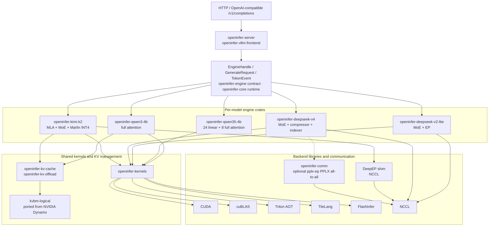

<p align="center">
  
</p>

<h1 align="center">openinfer</h1>

<p align="center">
  Pure Rust + CUDA LLM inference engine. No PyTorch. No model framework runtime.
</p>

<p align="center">
  <a href="#quickstart">Quickstart</a> &middot;
  <a href="#supported-models">Models</a> &middot;
  <a href="#api">API</a> &middot;
  <a href="#performance">Performance</a> &middot;
  <a href="#architecture">Architecture</a>
</p>

---

openinfer is an LLM inference engine built entirely in Rust and CUDA — no PyTorch, no ONNX, no framework runtime, every kernel and scheduler hand-written.

It serves frontier-scale models, from Qwen3 to the trillion-parameter Kimi-K2, and already holds its own against the best open-source inference frameworks.

## Quickstart

### Prerequisites

- Rust (2024 edition), CUDA Toolkit (nvcc, cuBLAS), CUDA-capable GPU
- NVIDIA driver R535 (CUDA 12.2) or newer; driver symbols resolve lazily at call time, so the `cuda-12090` cudarc feature does not raise the driver floor
- The default build (Qwen3-4B / 8B) is pure Rust + CUDA — no Python at all
- Python 3 + Triton for `qwen35-4b` feature builds (build-time only — no Python at runtime)
- TileLang for `deepseek-v4` feature builds (build-time only)
- `deepseek-v4` / `kimi-k2` EP paths additionally need NCCL ≥ 2.27 at runtime (`ncclAlltoAll`)

### Build & Run

```bash
# Download a model
huggingface-cli download Qwen/Qwen3-4B --local-dir models/Qwen3-4B

# Build & start server on port 8000 — no Python needed for the default Qwen3 build
export CUDA_HOME=/usr/local/cuda
cargo run --release
```

> **Note**: The server CLI is in `openinfer-server`. Model crates such as `openinfer-qwen3-4b`, `openinfer-qwen35-4b`, and `openinfer-deepseek-v4` contain model logic and diagnostics but are not server entrypoints. Use `cargo run --release` from the workspace root, or `cargo run --release -p openinfer-server -- --model-path <path>`.

```bash
# Try it
curl -s http://localhost:8000/v1/completions \
  -H "Content-Type: application/json" \
  -d '{"prompt": "The capital of France is", "max_tokens": 32}'

# Streaming
curl -N http://localhost:8000/v1/completions \
  -H "Content-Type: application/json" \
  -d '{"prompt": "Write a haiku about Rust:", "max_tokens": 64, "stream": true}'
```

> Always use `--release`. Debug builds are extremely slow for GPU/CUDA code.

<details>
<summary>More options</summary>

```bash
# Qwen3.5 requires the feature-gated Triton AOT kernels (Python + Triton at build time)
uv venv && uv pip install triton
export OPENINFER_TRITON_PYTHON=.venv/bin/python
cargo run --release --features qwen35-4b -- --model-path models/Qwen3.5-4B

# DeepSeek V4 Flash requires the feature-gated MP8 path and TileLang at build time
uv pip install "tilelang==0.1.9"
export OPENINFER_TILELANG_PYTHON=.venv/bin/python
cargo run --release --features deepseek-v4 -- --model-path models/DeepSeek-V4-Flash

# Disable CUDA Graph (useful for debugging)
cargo run --release -- --cuda-graph=false
```

**Environment variables:**

| Variable | Description |
|----------|-------------|
| `CUDA_HOME` | CUDA Toolkit path (default: `/usr/local/cuda`) |
| `OPENINFER_TRITON_PYTHON` | Python with Triton for `qwen35-4b` build-time AOT compilation |
| `OPENINFER_TILELANG_PYTHON` | Python with TileLang for `deepseek-v4` build-time kernel generation |
| `OPENINFER_CUDA_SM` | GPU SM target override when `nvidia-smi` unavailable (e.g. `120`) |

</details>

<details>
<summary>Windows</summary>

```powershell
$env:CUDA_PATH = "C:\Program Files\NVIDIA GPU Computing Toolkit\CUDA\v12.x"

# Default Qwen3 build needs no Python
cargo build --release
cargo run --release -p openinfer-server -- --model-path models/Qwen3-4B

# Qwen3.5 additionally needs Triton for the feature-gated AOT kernels
uv venv .venv --python 3.12
uv pip install "triton-windows<3.7"
$env:OPENINFER_TRITON_PYTHON = ".venv\Scripts\python.exe"
cargo run --release --features qwen35-4b -- --model-path models/Qwen3.5-4B
```

</details>

## Supported Models

| Model | Architecture | Params | Status |
|-------|-------------|--------|--------|
| [Qwen3-4B](https://huggingface.co/Qwen/Qwen3-4B) | Full attention (GQA) | 4B | Greedy + sampling, default feature, pure Rust + CUDA build |
| [Qwen3-8B](https://huggingface.co/Qwen/Qwen3-8B) | Full attention (GQA) | 8B | Greedy + sampling, default feature, pure Rust + CUDA build |
| [Qwen3.5-4B](https://huggingface.co/Qwen/Qwen3.5-4B) | Hybrid (24 linear + 8 full attention) | 4B | Greedy + sampling, feature-gated, `--features qwen35-4b` (build-time Triton) |
| [DeepSeek-V2-Lite](https://huggingface.co/deepseek-ai/DeepSeek-V2-Lite) | MoE + EP | 15.7B total / 2.4B active | Feature-gated, `--features deepseek-v2-lite`, 2-GPU path |
| [DeepSeek-V4-Flash](https://huggingface.co/deepseek-ai/DeepSeek-V4-Flash) | MoE + sparse attention (compressor + indexer), MP8 checkpoint | 671B total / 37B active | Initial greedy, feature-gated, 8-GPU MP8 |
| [Kimi-K2-Instruct](https://huggingface.co/moonshotai/Kimi-K2-Instruct) | MLA + MoE + Marlin INT4 | 1T total / 32B active | Feature-gated, `--features kimi-k2`, 8-GPU EP path |

Model type is auto-detected from `config.json` — just point `--model-path` at any supported model directory. Every model line is controlled by a cargo feature; only `qwen3-4b` is on by default, so the stock build serves Qwen3 with zero Python. Other lines require rebuilding `openinfer-server` with the matching `--features ...` flag before launch.

DeepSeek V4 support is intentionally narrower than the Qwen paths in the initial PR: it requires `--features deepseek-v4`, uses CUDA devices `0..7`, serves greedy requests only, terminates unsupported logprobs and non-greedy sampling requests with an explicit `stop_reason`, and does not use CUDA Graph yet.

## API

OpenAI-compatible `/v1/completions` endpoint.

| Field | Type | Default | Description |
|-------|------|---------|-------------|
| `prompt` | string | (required) | Input text |
| `max_tokens` | int | 128 | Maximum tokens to generate |
| `temperature` | float | 0.0 | Sampling temperature (0 = greedy) |
| `top_k` | int | 50 | Top-k sampling |
| `top_p` | float | 1.0 | Nucleus sampling threshold |
| `stream` | bool | false | Enable SSE streaming |

Sampling and logprob support is model-dependent. Qwen models support the sampling controls above; the initial DeepSeek V4 path accepts greedy requests only and reports unsupported parameters through `stop_reason`.

## Performance

Single RTX 5090 (32 GB), Qwen3-4B, BF16, TP1 — openinfer @ `0b42ed3`, vLLM 0.22.1, both driven
by the same `vllm bench serve` client (prefix cache on, seed 42, 1k-in / 128-out). Full tables
and method are in the [benchmark report](docs/benchmarks/qwen3-4b-serving-vllm-rtx5090.md).

### Footprint

No framework runtime means a small process that starts fast — one process, no `torch.compile`:

| Metric | openinfer | vLLM 0.22.1 |
|---|---:|---:|
| Resident memory (idle, loaded) | **771 MB** | 3814 MB |
| Startup → HTTP-ready (cold) | **3.0 s** | 70.0 s |
| Startup (warm compile cache) | **~3.0 s** | 32.7 s |

~5× smaller resident footprint, and a 3 s cold start against vLLM's 70 s — still 11× even
versus vLLM's warm `torch.compile` cache. openinfer is a single process; vLLM's RSS is summed
across its process tree.

<p align="center">
  
</p>

### Under serving load

Poisson arrivals, 1k-token prompts, 128-token outputs. Throughput tracks vLLM step-for-step
through the knee and edges ahead at saturation (1794 vs 1692 tok/s, ~14.0 vs 13.2 req/s at
QPS 16). vLLM keeps a per-token decode (TPOT) edge at mid load (QPS 8–12); both knee around
QPS 10–12, past which the queue dominates. The saturated-throughput cap from the earlier run is
gone — batched lm_head + sampling (#362) lifted it.

### Warm-cache latency — the chat / agent hot path

On the multi-turn chat and agent hot path, most of the prompt lands as a warm prefix-cache hit.
openinfer's first token stays flat as context grows — ~9 ms at 1k tokens, ~26 ms at 16k against
vLLM's ~96 ms (3.6×) — with p99 within ~1 ms of p50 at every length. Cold (uncached) prefill is
at parity (~1.1 s at 16k).

### KV offload — host-tier restore (pegaflow)

With `--kv-offload`, prefixes evicted from HBM are restored from host DRAM instead of recomputed.
At 16k that turns a 1.14 s cold prefill into a 126 ms host-tier restore (9.1×; 2.6× at 256
tokens). The tiering ladder at 16k: HBM hit ~26 ms < host-tier restore ~126 ms ≪ cold prefill
~1.14 s.

### Qwen3.5-4B vs current vLLM

Single RTX 5090 (32 GB), Qwen3.5-4B, BF16, TP1 — openinfer @ `f3dcdf4`,
vLLM 0.23.0 (latest stable checked 2026-06-15), both driven by
`vllm bench serve` 0.23.0. Fixed random prompts, 30 measured requests,
1 warmup, max concurrency 1, vLLM text-only with prefix cache off. Full flags and caveats
are in the [Qwen3.5 benchmark report](docs/benchmarks/qwen35-4b-serving-vllm-rtx5090.md).

| Workload | Metric | openinfer | vLLM 0.23.0 |
|---|---|---:|---:|
| 2048 input / 1 output | reported input tokens | 58,324 (1,944/request) | 61,440 (2,048/request) |
| 2048 input / 1 output | TTFT p50 (client-contract) | 101.8 ms | 115.2 ms |
| 2048 input / 1 output | TTFT p99 (client-contract) | 108.7 ms | 123.7 ms |
| 1024 input / 256 output | reported input tokens | 29,123 (971/request) | 30,720 (1,024/request) |
| 1024 input / 256 output | TTFT p50 (client-contract) | 53.7 ms | 67.4 ms |
| 1024 input / 256 output | TPOT p50 | 7.31 ms | **6.32 ms** |
| 1024 input / 256 output | output tok/s | 133.6 | **152.3** |

openinfer reports lower TTFT in this fixed-client run, but it also reports about 5%
fewer prompt tokens, so these rows are not a token-normalized prefill comparison.
vLLM still has the steady decode edge on this Qwen3.5 workload.

## Architecture



**Key design decisions:**

- **GPU-first runtime** — model execution stays in native Rust/CUDA paths; initial DeepSeek V4 still performs host-side greedy token selection from rank0 logits
- **Custom GPU kernels** — CUDA for decode-critical paths, Triton AOT for Qwen3.5 compatibility kernels, TileLang-generated CUDA for DeepSeek V4 compatibility kernels, FlashInfer for paged attention/sampling, NCCL for multi-GPU reductions, and cuBLAS for matrix multiplication
- **Fused operators where mature** — Qwen decode paths use fused attention/MLP kernels; DeepSeek V4 is currently a multi-stage MP8 path with TileLang kernels, NCCL reductions, and CUDA glue
- **CUDA Graph** on Qwen decode paths — eliminates kernel launch overhead where enabled
- **Per-model crate boundary** — Qwen3-4B owns its config, weights, scheduler/executor, tests, benches, and kernel plan in `openinfer-qwen3-4b`

**Model details:**

- **Qwen3**: 32 Q heads, 8 KV heads (GQA 4:1), head_dim=128
- **Qwen3.5**: hybrid — 24 linear attention layers (Gated Delta Rule) + 8 full attention layers, head_dim=256
- **DeepSeek V4 Flash**: feature-gated 8-way MP8 checkpoint with MoE routing, sparse attention, FP8/FP4 TileLang kernels, and OpenAI-compatible greedy serving

### What's not (yet) implemented

- General-purpose quantization for the Qwen lines — INT4 and FP8/FP4 today are model-specific (Kimi-K2 Marlin INT4, DeepSeek-V4 FP8/FP4), not yet available for the BF16 Qwen models

## Development

### Fresh-box dev setup

`scripts/setup_dev.sh` bootstraps a build environment on any fresh NVIDIA Ubuntu
host: apt build deps + `protobuf-compiler`, uv, the rustup nightly pinned by
`rust-toolchain.toml`, the vendored `flashinfer/3rdparty/cccl` submodule, then
`cargo build --release`. CUDA is a prerequisite — it detects `nvcc` and fails
loudly rather than installing a toolkit, so boot a CUDA image.

```bash
bash scripts/setup_dev.sh
# on a GPU whose arch the kernels don't target (e.g. V100 sm_70), compile for another:
OPENINFER_CUDA_SM=90 bash scripts/setup_dev.sh
```

To get the box itself, `scripts/prime_devbox.sh` provisions the cheapest match on
[Prime Intellect](https://www.primeintellect.ai/), has the box git-clone this
repo over HTTPS, and runs `setup_dev.sh` — see the script header for one-time setup.

### Tests

```bash
# Unit tests
cargo test --release --workspace --lib

# Accuracy and integration tests (need GPU + model weights)
OPENINFER_TEST_MODEL_PATH=models/Qwen3-4B cargo test --release -p openinfer-qwen3-4b --test hf_golden_gate
OPENINFER_TEST_MODEL_PATH=models/Qwen3.5-4B cargo test --release -p openinfer-qwen35-4b --features qwen35-4b --test hf_golden_gate
OPENINFER_TEST_MODEL_PATH=models/Qwen3.5-4B cargo test --release -p openinfer-qwen35-4b --features qwen35-4b --test e2e_scheduler
OPENINFER_TEST_MODEL_PATH=models/DeepSeek-V4-Flash cargo test --release -p openinfer-deepseek-v4 --features deepseek-v4 --test mp8_manifest
```

## License

Apache-2.0 — see [LICENSE](LICENSE) and [NOTICE](NOTICE). Components ported from
NVIDIA Dynamo (the `kvbm/kvbm-logical` crate) retain their original Apache-2.0 headers; see
[NOTICE_DYNAMO](NOTICE_DYNAMO).

## Star History

<p align="center">
  <a href="https://star-history.com/#openinfer-project/openinfer&Date">
    
  </a>
</p>
